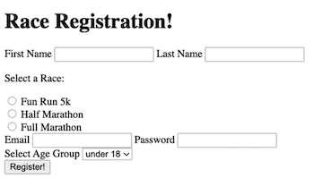

# Marathon Registration Form

Marathon registration form demonstrates a form with a collection of inputs, checkboxes, buttons, and drop-down menus. Certain inputs are required and are subject to validation checks before the form can be submitted.

## 🎉 Demo 

## ✨ Motivation 

This project is a put-together exercise for &lt;form&gt;, &lt;input&gt;, &lt;label&gt;, &lt;button&gt;, &lt;select&gt; and &lt;option&gt; elements as well as the form validations in HTML. I also experimented with CSS and Flexbox for styling to spice it up! Below is the original version from tutorial:

## 👏 Credits

This project is based on the HTML tutorial by Colt Steele on Udemy. 

Background image by Austris Augusts via Unsplash. 

